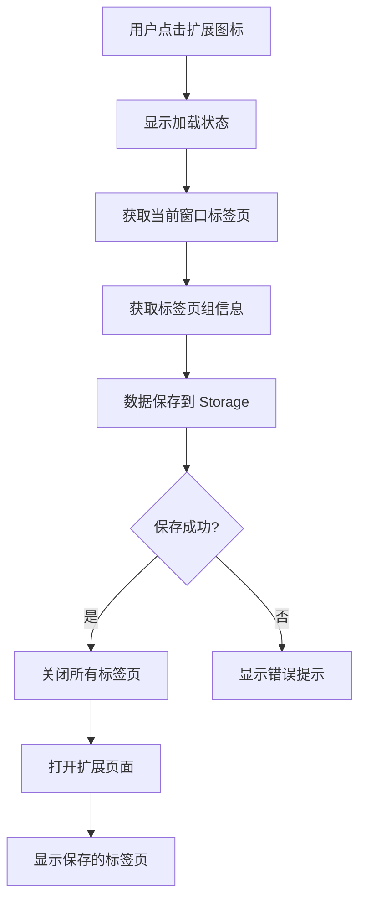
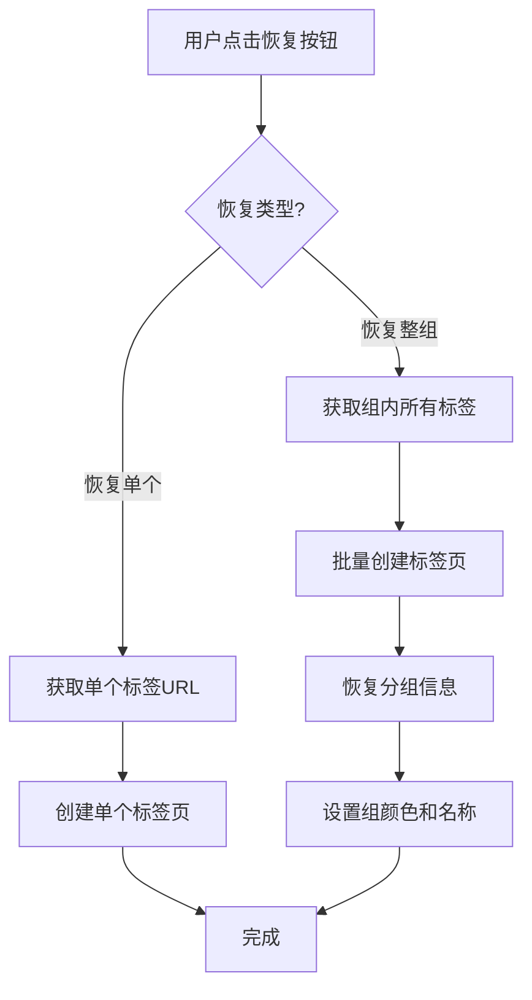
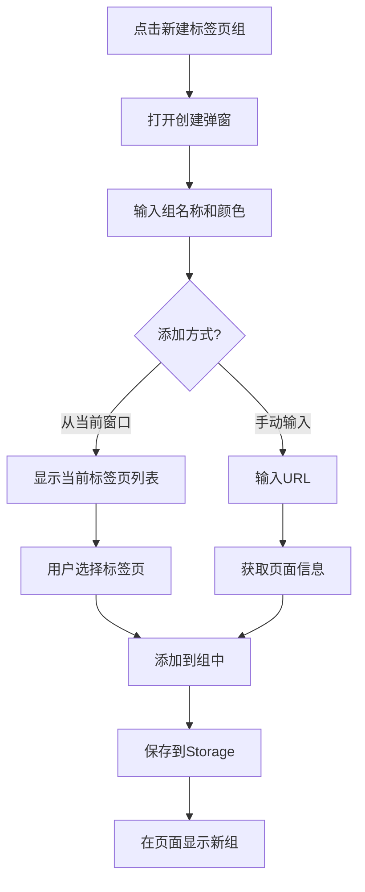
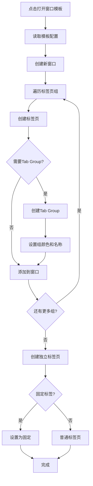
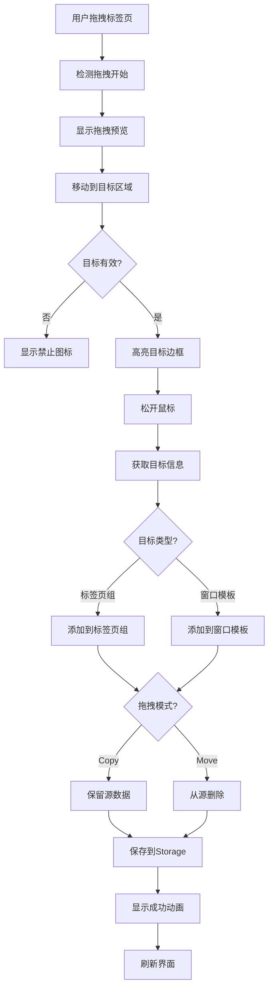
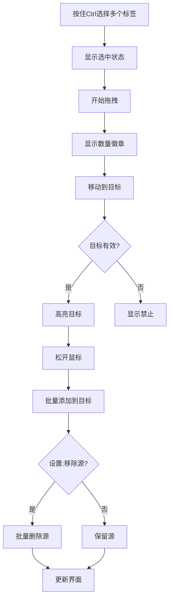

# OneTabs V2.0 产品需求文档 (PRD)

## 📋 文档信息

| 项目名称 | OneTabs - 标签页管理扩展 V2.0 |
| -------- | ----------------------------- |
| 文档版本 | V2.0                          |
| 创建日期 | 2026-01-20                    |
| 产品经理 | -                             |
| 目标版本 | 2.0.0                         |
| 文档状态 | 待评审                        |

---

## 🎯 一、产品概述

### 1.1 产品定位

OneTabs 是一款专注于提升浏览器效率的 Chrome 扩展，通过智能管理标签页和标签页组，帮助用户解决标签页过多导致的内存占用和信息混乱问题。

### 1.2 核心价值

- **快速收纳（OneTabs）**：一键关闭并保存当前窗口所有标签页，释放内存
- **常用标签组（Collections）**：手动创建和管理常用的标签页组合，快速访问
- **窗口模板（Window Templates）**：预设完整的窗口配置，一键打开工作环境
- **信息归档**：自动保存标签页数据，避免信息丢失
- **分组管理**：保留原有标签页组结构，便于后续恢复

#### 术语说明

- **会话（Session）**：每次点击保存按钮时，对当前浏览器窗口所有标签页和标签组的一次快照记录，按时间倒序展示，用于临时收纳
- **标签页组（Collection）**：用户手动创建的常用标签页集合，如"工作文档"、"学习资源"等，可随时打开
- **窗口模板（Window Template）**：包含多个标签页组或标签页的完整窗口配置，如"工作环境"包含代码编辑器、文档、通讯工具等

### 1.3 目标用户

- **重度浏览器用户**：经常打开大量标签页的用户
- **信息收集者**：需要保存和整理网页资源的用户
- **效率工作者**：追求高效工作流程的专业人士

---

## 👥 二、用户故事

### Epic 1: 标签页数据获取与展示

**作为** 一名频繁使用浏览器的用户  
**我希望** 能够查看当前窗口所有打开的标签页和标签页组  
**以便于** 了解我当前的浏览状态和标签分布情况

#### Story 1.1: 获取标签页数据

**作为** 用户  
**我希望** 点击扩展图标后，系统能自动获取当前窗口的所有标签页  
**以便于** 看到完整的标签页列表

**验收标准：**

- [ ] 点击扩展图标后，能获取当前窗口所有标签页
- [ ] 标签页数据包含：标题、URL、图标、所属分组信息
- [ ] 数据获取时间 < 200ms
- [ ] 支持获取普通标签页和固定标签页

#### Story 1.2: 获取标签页组数据

**作为** 使用标签页组功能的用户  
**我希望** 系统能识别并保留我的标签页分组信息  
**以便于** 恢复时保持原有的组织结构

**验收标准：**

- [ ] 能识别所有标签页组（Tab Groups）
- [ ] 组数据包含：组名称、组颜色、组内标签列表
- [ ] 未分组的标签页单独展示
- [ ] 保持标签页在组内的顺序

---

### Epic 2: 标签页保存与关闭（快速收纳）

**作为** 需要释放浏览器内存的用户  
**我希望** 能一键关闭所有标签页并保存它们到会话中  
**以便于** 减少内存占用，同时不丢失标签页信息

#### Story 2.1: 一键关闭标签页

**作为** 用户  
**我希望** 点击扩展图标后，自动关闭当前窗口所有标签页  
**以便于** 快速清理浏览器

**验收标准：**

- [ ] 点击图标触发关闭动作
- [ ] 关闭当前窗口所有标签页（除扩展页面本身）
- [ ] 关闭动作在数据保存完成后执行
- [ ] 关闭过程有加载提示
- [ ] 不关闭固定标签页（可选配置）

#### Story 2.2: 保存标签页数据

**作为** 用户  
**我希望** 关闭标签页前自动保存所有数据
**以便于** 后续能够恢复这些标签页

**验收标准：**

- [ ] 数据保存在 Chrome Storage 中
- [ ] 保存时间戳信息
- [ ] 保存分组结构
- [ ] 数据持久化，浏览器重启后仍可访问

---

### Epic 3: 标签页数据展示

**作为** 用户  
**我希望** 在扩展页面中看到所有已保存的标签页  
**以便于** 浏览和管理我的历史标签

#### Story 3.1: 分组展示标签页

**作为** 用户  
**我希望** 看到按原分组结构展示的标签页列表  
**以便于** 快速找到相关的标签页

**验收标准：**

- [ ] 每个标签页组独立展示
- [ ] 显示组名称和组颜色标识
- [ ] 显示组内标签页数量
- [ ] 未分组标签页独立区域展示
- [ ] 展示保存时间

#### Story 3.2: 标签页详细信息

**作为** 用户  
**我希望** 看到每个标签页的详细信息  
**以便于** 识别和选择需要的标签

**验收标准：**

- [ ] 显示网站图标（favicon）
- [ ] 显示页面标题
- [ ] 支持点击链接直接打开
- [ ] 鼠标悬停显示完整 URL
- [ ] 显示保存时间（相对时间）

---

### Epic 4: 标签页组管理（Collections）

**作为** 经常访问固定网站组合的用户  
**我希望** 能创建和管理常用的标签页组  
**以便于** 快速打开常用的多个网站

#### Story 4.1: 创建标签页组

**作为** 用户  
**我希望** 能手动创建标签页组并添加常用网站  
**以便于** 将相关的网站组织在一起

**验收标准：**

- [ ] 提供"创建标签页组"入口
- [ ] 可设置组名称和颜色
- [ ] 可添加多个标签页链接
- [ ] 支持从当前打开的标签页快速添加
- [ ] 支持手动输入 URL
- [ ] 自动获取网站标题和图标

#### Story 4.2: 管理标签页组

**作为** 用户  
**我希望** 能编辑、删除、排序标签页组  
**以便于** 保持组织结构的整洁

**验收标准：**

- [ ] 可编辑组名称和颜色
- [ ] 可在组内添加/删除标签页
- [ ] 可拖拽排序标签页
- [ ] 可拖拽排序标签页组
- [ ] 可删除整个标签页组
- [ ] 删除前有确认提示

#### Story 4.3: 打开标签页组

**作为** 用户  
**我希望** 能一键打开整个标签页组  
**以便于** 快速开始工作

**验收标准：**

- [ ] 点击"打开组"按钮打开所有标签页
- [ ] 可选择在当前窗口或新窗口打开
- [ ] 可选择是否创建标签页组（Chrome Tab Groups）
- [ ] 可选择只打开部分标签页
- [ ] 支持在后台打开

---

### Epic 5: 窗口管理（Window Templates）

**作为** 有多种工作场景的用户  
**我希望** 能创建包含多个标签页组的窗口模板  
**以便于** 一键打开完整的工作环境

#### Story 5.1: 创建窗口模板

**作为** 用户  
**我希望** 能基于当前窗口或手动创建窗口模板  
**以便于** 保存完整的工作环境配置

**验收标准：**

- [ ] 可从当前窗口保存为模板
- [ ] 可手动创建空白模板
- [ ] 可设置模板名称和描述
- [ ] 可添加多个标签页组（Collections）到模板
- [ ] 可添加独立标签页到模板
- [ ] 保留标签页组的颜色和名称

#### Story 5.2: 管理窗口模板

**作为** 用户  
**我希望** 能编辑和管理窗口模板  
**以便于** 适应工作环境的变化

**验收标准：**

- [ ] 可编辑模板名称和描述
- [ ] 可在模板中添加/删除标签页组
- [ ] 可在模板中添加/删除独立标签页
- [ ] 可调整标签页组的顺序
- [ ] 可删除整个模板
- [ ] 可复制模板

#### Story 5.3: 打开窗口模板

**作为** 用户  
**我希望** 能一键打开整个窗口模板  
**以便于** 快速切换工作场景

**验收标准：**

- [ ] 点击"打开窗口"按钮创建新窗口
- [ ] 在新窗口中恢复所有标签页组
- [ ] 恢复标签页组的颜色和名称
- [ ] 恢复标签页的顺序
- [ ] 支持在当前窗口打开（可选）
- [ ] 显示打开进度

---

### Epic 6: 拖拽快速管理

**作为** 需要快速整理标签页的用户  
**我希望** 能通过拖拽将会话中的标签页、标签页组添加到标签页组或窗口模板  
**以便于** 快速组织和管理标签页资源

#### Story 6.1: 拖拽标签页到标签页组

**作为** 用户  
**我希望** 能将会话列表中的标签页拖拽到现有标签页组  
**以便于** 快速将临时收纳的标签页转为常用标签

**验收标准：**

- [ ] 支持从会话列表拖拽单个标签页
- [ ] 拖拽时显示拖拽预览
- [ ] 悬停在标签页组上时显示高亮提示
- [ ] 松手时添加标签页到目标组
- [ ] 拖拽成功有视觉反馈
- [ ] 根据设置决定是否从会话中移除

#### Story 6.2: 拖拽内容到窗口模板

**作为** 用户  
**我希望** 能将标签页或标签页组拖拽到窗口模板  
**以便于** 快速构建和丰富窗口模板内容

**验收标准：**

- [ ] 支持从会话列表拖拽单个标签页到模板
- [ ] 支持拖拽到模板的标签页组中
- [ ] 支持拖拽到模板的独立标签页区域
- [ ] 支持从会话中拖拽整个标签页组到模板
- [ ] 支持从标签页组管理区拖拽标签页组到模板
- [ ] 拖拽标签页组时保留组名称、颜色和所有标签页
- [ ] 拖拽路径清晰可见
- [ ] 根据设置决定是否从源移除

#### Story 6.3: 批量拖拽操作

**作为** 用户  
**我希望** 能选中多个标签页进行批量拖拽  
**以便于** 提高整理效率

**验收标准：**

- [ ] 支持Ctrl/Cmd多选标签页
- [ ] 支持Shift连续选择
- [ ] 拖拽时显示选中数量
- [ ] 批量添加到目标位置
- [ ] 保持标签页顺序

#### Story 6.4: 跨区域拖拽

**作为** 高级用户  
**我希望** 标签页可以在不同区域间灵活拖拽  
**以便于** 实现更复杂的管理需求

**验收标准：**

- [ ] 支持标签页组之间互相拖拽标签页
- [ ] 支持标签页组拖拽到窗口模板
- [ ] 支持从窗口模板拖拽标签页到标签页组
- [ ] 支持会话内标签页重新排序
- [ ] 支持标签页组和模板的排序

---

## 🔧 三、功能需求

### 3.1 核心功能

#### 3.1.1 标签页数据获取

**功能描述：**  
使用 Chrome Tabs API 和 Tab Groups API 获取当前窗口的标签页数据

**API 使用：**

```javascript
// 获取当前窗口所有标签页
chrome.tabs.query({ currentWindow: true })

// 获取标签页组信息
chrome.tabGroups.query({ windowId: windowId })

// 获取标签页所属分组
tab.groupId
```

**数据结构：**

```javascript
{
  id: string,              // 保存记录的唯一ID
  timestamp: number,       // 保存时间戳
  windowId: number,        // 窗口ID
  groups: [                // 标签页组列表
    {
      groupId: number,     // 组ID
      title: string,       // 组名称
      color: string,       // 组颜色
      collapsed: boolean,  // 是否折叠
      tabs: [              // 组内标签页
        {
          id: number,      // 标签页ID
          title: string,   // 页面标题
          url: string,     // 页面URL
          favIconUrl: string, // 图标URL
          pinned: boolean, // 是否固定
          index: number    // 标签页位置
        }
      ]
    }
  ],
  ungroupedTabs: []        // 未分组的标签页
}
```

#### 3.1.2 标签页关闭

**功能描述：**  
在数据保存完成后，关闭当前窗口的所有标签页

**关闭逻辑：**

1. 获取当前窗口所有标签页 ID
2. 过滤掉扩展自身页面
3. 可选：过滤掉固定标签页
4. 使用 `chrome.tabs.remove()` 批量关闭

**安全机制：**

- 数据保存成功后才执行关闭
- 至少保留一个标签页（扩展页面）
- 关闭失败有错误提示

#### 3.1.3 数据持久化

**功能描述：**  
将标签页数据保存到 Chrome Storage 中

**存储策略：**

- 使用 `chrome.storage.local`
- 数据按时间倒序存储
- 支持多次保存记录
- 单次最大存储限制：5MB
- 总存储限制检查和提醒

**存储键名：**

```javascript
{
  "onetabs_sessions": [    // 历史会话列表（临时收纳）
    { session_data },
    { session_data }
  ],
  "onetabs_collections": [ // 用户创建的标签页组
    { collection_data },
    { collection_data }
  ],
  "onetabs_templates": [   // 窗口模板
    { template_data },
    { template_data }
  ],
  "onetabs_settings": {    // 用户设置
    autoClose: true,
    keepPinned: false,
    maxSessions: 50
  }
}
```

#### 3.1.5 标签页组（Collections）管理

**功能描述：**  
用户可手动创建和管理常用的标签页组合

**数据结构：**

```javascript
{
  id: string,              // 标签页组唯一ID
  name: string,            // 组名称，如"工作文档"
  color: string,           // 组颜色标识
  icon: string,            // 组图标（可选）
  createdAt: number,       // 创建时间
  updatedAt: number,       // 更新时间
  pinned: boolean,         // 是否固定在顶部
  tabs: [                  // 标签页列表
    {
      title: string,       // 页面标题
      url: string,         // 页面URL
      favIconUrl: string,  // 图标URL
      order: number        // 排序
    }
  ]
}
```

**核心功能：**

1. **创建标签页组**
   - 手动创建空白组
   - 从当前打开的标签页快速创建
   - 从会话中的标签页组转换

2. **添加标签页**
   - 手动输入 URL
   - 从当前窗口选择标签页
   - 拖拽添加

3. **管理操作**
   - 编辑组名称和颜色
   - 删除/添加标签页
   - 拖拽排序
   - 删除整个组

4. **打开操作**
   - 在当前窗口打开
   - 在新窗口打开
   - 创建 Chrome Tab Group
   - 后台打开

#### 3.1.6 窗口模板（Window Templates）管理

**功能描述：**  
创建包含多个标签页组和标签页的完整窗口配置

**数据结构：**

```javascript
{
  id: string,              // 模板唯一ID
  name: string,            // 模板名称，如"工作环境"
  description: string,     // 模板描述
  icon: string,            // 模板图标
  createdAt: number,       // 创建时间
  updatedAt: number,       // 更新时间
  collections: [           // 包含的标签页组
    {
      collectionId: string, // 引用的Collection ID
      name: string,        // 组名称（快照）
      color: string,       // 组颜色
      createGroup: boolean, // 是否创建Tab Group
      tabs: []             // 标签页列表（快照）
    }
  ],
  standaloneTabs: [        // 独立标签页（不属于任何组）
    {
      title: string,
      url: string,
      favIconUrl: string,
      pinned: boolean      // 是否固定标签页
    }
  ]
}
```

**核心功能：**

1. **创建模板**
   - 从当前窗口快照创建
   - 手动创建空白模板
   - 复制现有模板

2. **编辑模板**
   - 添加/删除 Collections
   - 添加/删除独立标签页
   - 调整顺序
   - 配置是否创建 Tab Group

3. **打开模板**
   - 创建新窗口
   - 按配置恢复所有标签页组
   - 恢复独立标签页
   - 显示进度条

**使用场景示例：**

```javascript
// "工作环境"模板
{
  name: "工作环境",
  description: "日常开发使用的所有工具",
  collections: [
    {
      name: "开发工具",
      tabs: [
        { url: "http://localhost:3000", title: "本地开发" },
        { url: "https://github.com", title: "GitHub" }
      ]
    },
    {
      name: "文档",
      tabs: [
        { url: "https://vuejs.org", title: "Vue.js" },
        { url: "https://developer.mozilla.org", title: "MDN" }
      ]
    }
  ],
  standaloneTabs: [
    { url: "https://mail.google.com", title: "Gmail", pinned: true }
  ]
}
```

#### 3.1.7 拖拽管理功能

**功能描述：**  
支持通过拖拽操作快速将会话中的标签页添加到标签页组或窗口模板

**拖拽源（Drag Source）：**
- 会话列表中的单个标签页
- 会话列表中的标签页组（整组拖拽）
- 标签页组管理区的标签页组卡片（整组拖拽）
- 标签页组中的单个标签页
- 窗口模板中的标签页

**拖拽目标（Drop Target）：**
- 现有的标签页组卡片
- 窗口模板卡片（整体）
- 窗口模板内的标签页组区域（编辑状态）
- 窗口模板内的独立标签页区域（编辑状态）

**关键拖拽场景：**

**场景1：会话标签页 → 标签页组**
- 拖拽单个标签页到标签页组
- 标签页添加到组的末尾
- 根据设置决定是否从会话移除

**场景2：会话标签页 → 窗口模板**
- 拖拽单个标签页到模板
- 添加到模板的独立标签页区域
- 可在模板编辑界面中调整位置

**场景3：会话标签页组 → 窗口模板（重点）**
- 从会话中拖拽整个标签页组（包含组名、颜色、所有标签页）
- 拖拽到窗口模板卡片
- 整组添加到模板的标签页组列表
- 自动保留组的所有属性（名称、颜色）
- 包含组内所有标签页
- 默认设置为"创建Tab Group"

**场景4：标签页组管理 → 窗口模板（重点）**
- 从标签页组管理区拖拽标签页组卡片
- 拖拽到窗口模板卡片
- 建立引用关系（推荐）或创建快照
- 标签页组更新时，模板自动同步（引用模式）
- 支持在模板编辑时"锁定版本"切换为快照模式

**场景5：标签页组之间互相拖拽**
- 从标签页组A拖拽标签页到标签页组B
- 标签页移动或复制到目标组

**拖拽交互设计：**

1. **拖拽开始**
   ```javascript
   // 检测拖拽开始
   onDragStart(event) {
     // 设置拖拽数据
     event.dataTransfer.setData('tab', JSON.stringify(tabData))
     // 设置拖拽效果
     event.dataTransfer.effectAllowed = 'copy' // 或 'move'
     // 显示拖拽预览
     showDragPreview(tabData)
   }
   ```

2. **拖拽进行中**
   - 显示拖拽游标和预览
   - 高亮有效的放置目标
   - 实时更新放置位置提示

3. **拖拽放置**
   ```javascript
   onDrop(event, target) {
     const tabData = JSON.parse(event.dataTransfer.getData('tab'))
     
     // 根据目标类型执行操作
     if (target.type === 'collection') {
       addTabToCollection(target.id, tabData)
     } else if (target.type === 'template') {
       addTabToTemplate(target.id, tabData)
     }
     
     // 根据设置决定是否从源删除
     if (settings.removeAfterDrag) {
       removeFromSource(tabData)
     }
   }
   ```

**拖拽效果模式：**
- **Copy模式**：拖拽后保留原标签页（默认）
- **Move模式**：拖拽后从会话中移除
- 通过设置或按住Shift键切换

**视觉反馈：**
- 拖拽中的标签页半透明
- 有效目标区域高亮边框（绿色）
- 无效目标区域显示禁止图标
- 放置成功显示动画效果
- 多选拖拽显示数量徽章

**拖拽规则表：**

| 拖拽源 | 可拖拽到 | 效果 | 说明 |
|--------|----------|------|------|
| 会话中单个标签页 | 标签页组 | 添加到组末尾 | 根据设置保留/移除源 |
| 会话中单个标签页 | 窗口模板 | 添加到独立标签页区域 | 可在模板编辑中调整位置 |
| 会话中整个标签页组 | 窗口模板 | 整组添加到模板的标签页组列表 | ⭐ 保留组名、颜色、所有标签 |
| 标签页组管理区的标签页组 | 窗口模板 | 建立引用关系或创建快照 | ⭐ 推荐引用模式，支持自动同步 |
| 标签页组内的标签页 | 其他标签页组 | 移动/复制到目标组 | 跨组管理 |
| 标签页组内的标签页 | 窗口模板 | 添加为独立标签页 | 从组中提取单个标签 |

**特别说明：标签页组拖拽到窗口模板**

有两种拖拽来源，效果略有不同：

1. **从会话收纳拖拽标签页组**
   - 来源：会话列表中保存的标签页组
   - 效果：创建快照，复制整组数据到模板
   - 特点：静态快照，不会随原会话变化

2. **从标签页组管理区拖拽**
   - 来源：常用标签页组管理区的标签页组卡片
   - 效果：建立引用关系（推荐）
   - 特点：动态引用，标签页组更新时模板自动同步
   - 可选：在模板编辑时切换为"锁定版本"（快照模式）

**数据更新流程：**
```javascript
async function handleTabDrop(sourceTab, targetCollection) {
  // 1. 添加到目标
  await collectionsStore.addTab(targetCollection.id, sourceTab)
  
  // 2. 根据设置决定是否删除源
  if (settings.dragAndDropRemoveSource) {
    await sessionsStore.removeTab(sourceTab.sessionId, sourceTab.id)
  }
  
  // 3. 保存到Storage
  await saveToStorage()
  
  // 4. 显示成功提示
  showToast('标签页已添加到 ' + targetCollection.name)
}
```

#### 3.1.8 标签页展示（原功能）

**功能描述：**  
在扩展页面展示所有已保存的标签页会话

**展示规则：**

- 按保存时间倒序排列
- 每个会话独立卡片展示
- 分组信息清晰标识
- 支持折叠/展开组
- 响应式布局

---

### 3.2 用户界面

#### 3.2.1 扩展图标（Browser Action）

**交互行为：**

- **点击图标** → 触发保存和关闭流程
- **图标状态** → 显示当前标签页数量（Badge）
- **右键菜单** → 可选：仅保存不关闭

#### 3.2.2 扩展主页面（统一页面布局）

**页面结构：**

```
┌──────────────────────────────────────────────────────────────┐
│  🔖 OneTabs                        [搜索] [设置]              │  ← 顶部导航
├──────────────────────────────────────────────────────────────┤
│  [🚀 窗口模板]  [📁 标签页组]  [📦 会话收纳]                 │  ← Tab 导航
├──────────────────────────────────────────────────────────────┤
│                                                              │
│  🚀 窗口模板                                [+ 新建模板]      │
│  ────────────────────────────────────────────────────────  │
│  ┌─────────────────────────────────────────────────────┐  │
│  │ 💼 工作环境                            [打开] [编辑]  │  │
│  │ 包含 3 个标签页组 • 5 个独立标签页                    │  │
│  │ 最后更新：2天前                                      │  │
│  └─────────────────────────────────────────────────────┘  │
│                                                              │
│  ┌─────────────────────────────────────────────────────┐  │
│  │ 🎓 学习环境                            [打开] [编辑]  │  │
│  │ 包含 2 个标签页组 • 8 个独立标签页                    │  │
│  │ 最后更新：1周前                                      │  │
│  └─────────────────────────────────────────────────────┘  │
│                                                              │
│  ────────────────────────────────────────────────────────  │
│                                                              │
│  📁 常用标签页组                            [+ 新建标签组]    │
│  ────────────────────────────────────────────────────────  │
│  ┌─────────────────────────────────────────────────────┐  │
│  │ 🔴 工作文档 (6)                       [打开] [编辑]   │  │
│  │   📄 项目需求文档.doc                                │  │
│  │   📊 数据分析报告.xlsx                               │  │
│  │   📋 会议记录.md                      [展开 ▼]       │  │
│  └─────────────────────────────────────────────────────┘  │
│                                                              │
│  ┌─────────────────────────────────────────────────────┐  │
│  │ 🔵 开发工具 (4)                       [打开] [编辑]   │  │
│  │   🌐 GitHub - Pull Requests                          │  │
│  │   📊 Google Analytics                                │  │
│  │   💻 VS Code - Web                    [展开 ▼]       │  │
│  └─────────────────────────────────────────────────────┘  │
│                                                              │
│  ────────────────────────────────────────────────────────  │
│                                                              │
│  📦 会话收纳                                                 │
│  ────────────────────────────────────────────────────────  │
│  ┌─────────────────────────────────────────────────────┐  │
│  │ 📦 2026-01-20 15:30 • 共15个标签      [恢复] [删除]  │  │
│  │ ─────────────────────────────────────────────────── │  │
│  │  📂 工作相关 (5)                     [恢复组] [删除]  │  │
│  │    🌐 Gmail - Inbox                                  │  │
│  │    📊 Google Sheets - Q4 Report                      │  │
│  │    💼 Slack - #general                               │  │
│  │    ...                                [展开 ▼]       │  │
│  │                                                       │  │
│  │  📂 学习资源 (3)                     [恢复组] [删除]  │  │
│  │    📖 MDN Web Docs                                   │  │
│  │    🎓 Vue.js Documentation            [展开 ▼]       │  │
│  │                                                       │  │
│  │  📄 未分组 (7)                       [恢复] [删除]    │  │
│  │    🏠 GitHub                                         │  │
│  │    🔍 Stack Overflow                  [展开 ▼]       │  │
│  └─────────────────────────────────────────────────────┘  │
│                                                              │
│  ┌─────────────────────────────────────────────────────┐  │
│  │ 📦 2026-01-19 09:15 • 共8个标签       [恢复] [删除]  │  │
│  │ ...                                                  │  │
│  └─────────────────────────────────────────────────────┘  │
└──────────────────────────────────────────────────────────────┘
```

**页面元素说明：**

1. **顶部导航栏**
   - Logo + 产品名称
   - 全局搜索框（搜索标签页、标签页组、模板）
   - 设置按钮

2. **Tab 导航**（三个主要功能模块，在同一页面内切换）
   - **窗口模板**：管理完整的工作环境
   - **标签页组**：管理常用的标签页集合
   - **会话收纳**：查看历史保存的会话
   
   注：使用Tab组件（如PrimeVue Tabs）在同一页面内切换，不使用Vue Router路由切换

3. **窗口模板区域**
   - 模板卡片：显示名称、包含的资源数量、最后更新时间
   - 操作：打开窗口、编辑模板
   - 新建模板按钮

4. **标签页组区域**
   - 组卡片：显示组名、颜色、标签页数量
   - 可折叠的标签页列表
   - 操作：打开组、编辑组
   - 新建标签页组按钮
   - 支持拖拽排序

5. **会话收纳区域**
   - 按时间倒序显示
   - 每个会话独立卡片
   - 显示保存时间和标签页总数
   - 内部按标签页组展示
   - 操作：恢复整个会话、恢复单个组、删除

**交互特性：**

- 所有区域支持折叠/展开
- 标签页组和模板支持拖拽排序
- 支持拖拽标签页到不同组
- 悬停显示完整信息
- 右键菜单提供更多操作

#### 3.2.3 创建/编辑标签页组弹窗

**弹窗结构：**

```
┌─────────────────────────────────────────┐
│  新建标签页组                      [✕]   │
├─────────────────────────────────────────┤
│  组名称：                                │
│  [__________________]                   │
│                                         │
│  组颜色：                                │
│  🔴 🔵 🟢 🟡 🟣 🟠 ⚪                    │
│                                         │
│  添加标签页：                            │
│  ┌─────────────────────────────────┐  │
│  │ 🌐 输入URL或从当前窗口选择      │  │
│  └─────────────────────────────────┘  │
│                                         │
│  当前标签页：                            │
│  [ ] 📄 GitHub - Dashboard              │
│  [ ] 📊 Google Analytics                │
│  [✓] 💻 VS Code - Remote                │
│                                         │
│  已添加的标签页：                        │
│  1. 💻 VS Code - Remote      [删除] [↑↓]│
│                                         │
│           [取消]      [保存]            │
└─────────────────────────────────────────┘
```

#### 3.2.4 创建/编辑窗口模板弹窗

**弹窗结构：**

```
┌─────────────────────────────────────────┐
│  新建窗口模板                      [✕]   │
├─────────────────────────────────────────┤
│  模板名称：                              │
│  [__________________]                   │
│                                         │
│  描述：                                  │
│  [__________________]                   │
│                                         │
│  来源：                                  │
│  ⚫ 从当前窗口创建                        │
│  ⚪ 手动选择标签页组                      │
│                                         │
│  包含的标签页组：                        │
│  [+ 添加标签页组]                        │
│  ┌─────────────────────────────────┐  │
│  │ 🔴 工作文档 (6个标签)           │  │
│  │ [✓] 创建Tab Group   [删除] [↑↓] │  │
│  └─────────────────────────────────┘  │
│  ┌─────────────────────────────────┐  │
│  │ 🔵 开发工具 (4个标签)           │  │
│  │ [✓] 创建Tab Group   [删除] [↑↓] │  │
│  └─────────────────────────────────┘  │
│                                         │
│  独立标签页：                            │
│  [+ 添加标签页]                          │
│  • Gmail  [✓] 固定  [删除]              │
│                                         │
│           [取消]      [保存]            │
└─────────────────────────────────────────┘
```

#### 3.2.5 设置页面

**配置项扩展：**

**快速收纳设置：**

- [ ] 点击图标后自动关闭标签页
- [ ] 保留固定标签页
- [ ] 最大保存会话数量（默认50）

**标签页组设置：**

- [ ] 打开标签页组时自动创建 Tab Group
- [ ] 新窗口打开还是当前窗口
- [ ] 后台打开标签页

**窗口模板设置：**

- [ ] 打开模板时关闭当前窗口
- [ ] 保持窗口大小和位置

**拖拽功能设置：**

- [ ] 启用拖拽功能（默认开启）
- [ ] 拖拽后从源列表移除标签页（默认关闭）
- [ ] 拖拽时显示预览（默认开启）
- [ ] 需要按住 Shift 键才能移动模式（默认关闭）
- [ ] 多选拖拽最大数量（默认20）

**数据管理：**

- [ ] 导出所有数据（JSON）
- [ ] 导入数据
- [ ] 清空会话收纳
- [ ] 清空所有数据

---

### 3.3 权限需求（保持不变）
   - 操作按钮：全部恢复、删除会话

3. **标签组区域**
   - 组颜色指示器
   - 组名称
   - 标签页数量
   - 操作：恢复组、删除组

4. **标签页项**
   - Favicon
   - 页面标题
   - 点击打开链接
   - 悬停显示 URL

#### 3.2.3 设置页面（可选）

**配置项：**

- [ ] 点击图标后自动关闭标签页
- [ ] 保留固定标签页
- [ ] 最大保存会话数量
- [ ] 数据导出/导入
- [ ] 清空所有数据

---

### 3.3 权限需求

#### Manifest V3 权限声明

```json
{
  "permissions": [
    "tabs", // 读取和操作标签页
    "tabGroups", // 访问标签页组
    "storage", // 本地数据存储
    "activeTab" // 访问当前活动标签
  ],
  "host_permissions": [
    "<all_urls>" // 访问所有网站（获取favicon）
  ]
}
```

---

## 🎨 四、交互设计

### 4.1 用户操作流程

#### 流程 1：保存标签页



#### 流程 2：恢复标签页



#### 流程 3：创建标签页组



#### 流程 4：打开窗口模板



#### 流程 5：拖拽标签页到标签页组



#### 流程 6：批量拖拽操作



### 4.2 状态反馈

#### 4.2.1 加载状态

- **获取数据中**：图标显示加载动画
- **保存中**：页面显示"正在保存标签页..."
- **关闭中**：页面显示"正在关闭标签页..."

#### 4.2.2 成功状态

- **保存成功**：显示成功提示，展示保存的标签页
- **恢复成功**：标签页在新窗口打开
- **拖拽成功**：目标区域显示添加动画，Toast提示操作结果

#### 4.2.3 错误状态

- **权限不足**：提示用户授予必要权限
- **保存失败**：显示错误信息，不执行关闭
- **存储空间不足**：提示用户清理旧数据
- **拖拽失败**：显示错误提示，自动回退到原位置

#### 4.2.4 拖拽状态反馈

- **拖拽中**：源标签页半透明，显示拖拽游标
- **悬停有效目标**：绿色高亮边框，+号提示
- **悬停无效目标**：红色边框，禁止图标
- **放置成功**：淡入动画，Toast提示"已添加到xxx"
- **放置失败**：震动动画，Toast提示错误原因

---

## 💻 五、技术实现

### 5.1 技术栈

- **前端框架**：Vue 3 + Composition API
- **状态管理**：Pinia
- **构建工具**：Vite
- **UI 框架**：Tailwind CSS + PrimeVue
- **拖拽库**：原生 HTML5 Drag & Drop API 或 VueDraggable
- **Chrome API**：Manifest V3

### 5.2 核心模块

#### 5.2.1 Background Service Worker

**职责：**

- 监听扩展图标点击事件
- 执行标签页保存和关闭逻辑
- 处理跨页面通信

**关键代码：**

```javascript
// background.js
chrome.action.onClicked.addListener(async () => {
  // 1. 获取当前窗口
  const currentWindow = await chrome.windows.getCurrent()

  // 2. 获取所有标签页
  const tabs = await chrome.tabs.query({ windowId: currentWindow.id })

  // 3. 获取标签页组
  const groups = await chrome.tabGroups.query({ windowId: currentWindow.id })

  // 4. 组织数据结构
  const sessionData = organizeTabData(tabs, groups)

  // 5. 保存到 Storage
  await saveToStorage(sessionData)

  // 6. 关闭标签页
  await closeAllTabs(tabs)

  // 7. 打开扩展页面
  chrome.tabs.create({ url: chrome.runtime.getURL('index.html') })
})
```

#### 5.2.2 数据管理模块

**职责：**

- 标签页数据的增删改查
- Storage 读写操作
- 数据格式转换

**Store 结构：**

```javascript
// stores/sessionsStore.js - 会话收纳
export const useSessionsStore = defineStore('sessions', {
  state: () => ({
    sessions: [],           // 所有会话
    currentSession: null    // 当前查看的会话
  }),
  
  actions: {
    async loadSessions() {
      // 从 Storage 加载会话
    },
    
    async saveSession(sessionData) {
      // 保存新会话
    },
    
    async restoreGroup(sessionId, groupId) {
      // 恢复标签页组
    },
    
    async deleteSession(sessionId) {
      // 删除会话
    }
  }
})

// stores/collectionsStore.js - 标签页组管理
export const useCollectionsStore = defineStore('collections', {
  state: () => ({
    collections: [],        // 所有标签页组
    currentCollection: null // 当前编辑的标签页组
  }),
  
  actions: {
    async loadCollections() {
      // 加载所有标签页组
    },
    
    async createCollection(data) {
      // 创建新标签页组
    },
    
    async updateCollection(id, data) {
      // 更新标签页组
    },
    
    async deleteCollection(id) {
      // 删除标签页组
    },
    
    async openCollection(id, options) {
      // 打开标签页组
      // options: { newWindow, createGroup, background }
    },
    
    async reorderCollections(newOrder) {
      // 重新排序标签页组
    }
  }
})

// stores/templatesStore.js - 窗口模板管理
export const useTemplatesStore = defineStore('templates', {
  state: () => ({
    templates: [],          // 所有窗口模板
    currentTemplate: null   // 当前编辑的模板
  }),
  
  actions: {
    async loadTemplates() {
      // 加载所有模板
    },
    
    async createTemplate(data) {
      // 创建新模板
    },
    
    async createFromCurrentWindow() {
      // 从当前窗口创建模板
    },
    
    async updateTemplate(id, data) {
      // 更新模板
    },
    
    async deleteTemplate(id) {
      // 删除模板
    },
    
    async openTemplate(id, options) {
      // 打开窗口模板
      // options: { closeCurrentWindow }
    }
  }
})
```

#### 5.2.3 UI 组件

**组件列表：**

**通用组件：**
- `AppHeader.vue` - 顶部导航栏
- `MainView.vue` - 主视图容器（包含Tab导航和内容区）
- `TabNavigation.vue` - Tab 导航组件（内部状态管理，不依赖路由）
- `SearchBar.vue` - 搜索框

**会话收纳组件：**
- `SessionCard.vue` - 会话卡片
- `TabGroup.vue` - 标签页组（会话内）
- `TabItem.vue` - 单个标签页

**标签页组管理组件：**
- `CollectionCard.vue` - 标签页组卡片
- `CollectionEditor.vue` - 编辑弹窗
- `TabSelector.vue` - 标签页选择器

**窗口模板组件：**
- `TemplateCard.vue` - 模板卡片
- `TemplateEditor.vue` - 模板编辑器
- `CollectionSelector.vue` - 标签页组选择器

**操作组件：**
- `ActionMenu.vue` - 右键菜单
- `ConfirmDialog.vue` - 确认对话框
- `Toast.vue` - 提示消息

**拖拽相关组件：**
- `DraggableTab.vue` - 可拖拽的标签页组件
- `DropZone.vue` - 拖拽放置区域组件
- `DragPreview.vue` - 拖拽预览组件
- `DragHelper.js` - 拖拽辅助工具类

**拖拽组件实现示例：**

```vue
<!-- DraggableTab.vue -->
<template>
  <div
    class="draggable-tab"
    :draggable="isDraggable"
    @dragstart="handleDragStart"
    @dragend="handleDragEnd"
  >
    <slot />
  </div>
</template>

<script setup>
import { computed } from 'vue'
import { useSettingsStore } from '@/stores/settingsStore'

const props = defineProps({
  tabData: Object,
  isDraggable: { type: Boolean, default: true }
})

const emit = defineEmits(['dragStart', 'dragEnd'])
const settings = useSettingsStore()

const handleDragStart = (event) => {
  event.dataTransfer.effectAllowed = settings.dragAndDropRemoveSource ? 'move' : 'copy'
  event.dataTransfer.setData('application/json', JSON.stringify(props.tabData))
  emit('dragStart', props.tabData)
}

const handleDragEnd = (event) => {
  emit('dragEnd', event)
}
</script>
```

```vue
<!-- DropZone.vue -->
<template>
  <div
    class="drop-zone"
    :class="{ 'drop-zone--active': isOver, 'drop-zone--invalid': !canDrop }"
    @dragover.prevent="handleDragOver"
    @dragleave="handleDragLeave"
    @drop.prevent="handleDrop"
  >
    <slot />
  </div>
</template>

<script setup>
import { ref } from 'vue'

const props = defineProps({
  targetType: String, // 'collection' | 'template'
  targetId: String,
  canDrop: { type: Boolean, default: true }
})

const emit = defineEmits(['drop'])
const isOver = ref(false)

const handleDragOver = (event) => {
  if (props.canDrop) {
    isOver.value = true
    event.dataTransfer.dropEffect = 'copy'
  }
}

const handleDragLeave = () => {
  isOver.value = false
}

const handleDrop = (event) => {
  isOver.value = false
  const tabData = JSON.parse(event.dataTransfer.getData('application/json'))
  emit('drop', { tabData, targetType: props.targetType, targetId: props.targetId })
}
</script>
```

---

## 📊 六、数据流图

```
┌─────────────────┐
│   用户点击图标    │
└────────┬────────┘
         │
         ▼
┌─────────────────┐
│ Background.js   │ ◄─── Chrome Tabs API
│  - 获取标签页   │ ◄─── Chrome TabGroups API
│  - 组织数据     │
└────────┬────────┘
         │
         ▼
┌─────────────────┐
│ Chrome Storage  │
│  - 持久化存储   │
└────────┬────────┘
         │
         ▼
┌─────────────────┐
│   扩展页面      │
│  - 读取数据     │
│  - 渲染UI       │
└────────┬────────┘
         │
         ▼
┌─────────────────┐
│   用户交互      │
│  - 恢复标签     │
│  - 删除会话     │
└─────────────────┘
```

---

## 🧪 七、测试用例

### 7.1 功能测试

#### TC-001: 基础标签页保存

**前置条件：**

- 浏览器已安装扩展
- 当前窗口有 5 个标签页（无分组）

**测试步骤：**

1. 点击扩展图标
2. 等待处理完成

**预期结果：**

- [ ] 5 个标签页全部关闭
- [ ] 扩展页面自动打开
- [ ] 显示刚保存的 5 个标签页
- [ ] 标签页信息完整（标题、URL、图标）

#### TC-002: 标签页组保存

**前置条件：**

- 当前窗口有 10 个标签页
- 分为 3 个标签页组：红色组(3个)、蓝色组(4个)、绿色组(3个)

**测试步骤：**

1. 点击扩展图标
2. 检查扩展页面

**预期结果：**

- [ ] 所有标签页关闭
- [ ] 显示 3 个标签页组
- [ ] 每个组显示正确的颜色
- [ ] 每个组的标签页数量正确
- [ ] 组内标签页顺序保持一致

#### TC-003: 混合场景保存

**前置条件：**

- 2 个固定标签页
- 1 个红色标签页组（3个标签）
- 4 个未分组标签页

**测试步骤：**

1. 点击扩展图标

**预期结果：**

- [ ] 固定标签页是否关闭（根据设置）
- [ ] 分组和未分组标签分开显示
- [ ] 所有数据正确保存

#### TC-004: 恢复标签页组

**前置条件：**

- 已有保存的会话，包含标签页组

**测试步骤：**

1. 点击某个组的"恢复"按钮
2. 观察浏览器

**预期结果：**

- [ ] 标签页在新窗口打开（或当前窗口）
- [ ] 标签页组正确创建
- [ ] 组颜色正确
- [ ] 组名称正确
- [ ] 标签页顺序正确

#### TC-005: 恢复单个标签页

**前置条件：**

- 已有保存的会话

**测试步骤：**

1. 点击某个标签页链接

**预期结果：**

- [ ] 在新标签页打开对应URL
- [ ] 原保存的数据不受影响

### 7.2 边界测试

#### TC-006: 大量标签页

**测试条件：**

- 打开 100+ 个标签页

**预期结果：**

- [ ] 保存过程不超过 3 秒
- [ ] 所有标签页正确保存
- [ ] 页面渲染流畅

#### TC-007: 特殊字符处理

**测试条件：**

- 标签页标题包含特殊字符：`<>'"&`
- URL 包含中文、空格

**预期结果：**

- [ ] 特殊字符正确显示
- [ ] URL 正确编码
- [ ] 点击链接能正常打开

#### TC-008: 存储空间限制

**测试条件：**

- 保存大量会话直到接近存储限制

**预期结果：**

- [ ] 显示存储空间警告
- [ ] 提示用户清理旧数据
- [ ] 不允许继续保存

### 7.3 异常测试

#### TC-009: 权限不足

**测试条件：**

- 用户未授予必要权限

**预期结果：**

- [ ] 显示权限请求提示
- [ ] 引导用户授权
- [ ] 授权后功能正常

#### TC-010: 网络异常

**测试条件：**

- Favicon 加载失败

**预期结果：**

- [ ] 显示默认图标
- [ ] 不影响其他功能
- [ ] 不报错

### 7.4 标签页组管理测试

#### TC-011: 创建标签页组

**前置条件：**
- 扩展已安装
- 当前窗口有多个标签页

**测试步骤：**
1. 切换到"标签页组"Tab
2. 点击"新建标签页组"
3. 输入组名称"工作文档"
4. 选择蓝色
5. 从当前窗口选择3个标签页
6. 点击保存

**预期结果：**
- [ ] 标签页组创建成功
- [ ] 显示正确的名称和颜色
- [ ] 包含选中的3个标签页
- [ ] 显示标签页图标和标题
- [ ] 数据持久化保存

#### TC-012: 打开标签页组

**前置条件：**
- 已创建标签页组"工作文档"（包含5个标签）

**测试步骤：**
1. 点击标签页组的"打开"按钮
2. 选择"在新窗口打开"
3. 勾选"创建Tab Group"

**预期结果：**
- [ ] 创建新窗口
- [ ] 打开5个标签页
- [ ] 创建 Chrome Tab Group
- [ ] Tab Group 颜色和名称正确
- [ ] 标签页顺序正确

#### TC-013: 编辑标签页组

**前置条件：**
- 已创建标签页组

**测试步骤：**
1. 点击"编辑"按钮
2. 修改组名称
3. 添加2个新标签页
4. 删除1个现有标签页
5. 拖拽调整顺序
6. 保存

**预期结果：**
- [ ] 所有修改正确保存
- [ ] 标签页数量正确
- [ ] 顺序正确调整
- [ ] 页面立即更新

### 7.5 窗口模板测试

#### TC-014: 从当前窗口创建模板

**前置条件：**
- 当前窗口有2个 Tab Group
- 有3个未分组标签页
- 有1个固定标签页

**测试步骤：**
1. 切换到"窗口模板"Tab
2. 点击"新建模板"
3. 选择"从当前窗口创建"
4. 输入模板名称"工作环境"
5. 添加描述
6. 保存

**预期结果：**
- [ ] 模板创建成功
- [ ] 包含2个标签页组
- [ ] 包含3个独立标签页
- [ ] 固定标签页标记正确
- [ ] 保留所有分组信息

#### TC-015: 打开窗口模板

**前置条件：**
- 已创建窗口模板"工作环境"

**测试步骤：**
1. 点击模板的"打开"按钮
2. 观察窗口创建过程

**预期结果：**
- [ ] 创建新窗口
- [ ] 所有标签页组正确恢复
- [ ] Tab Group 颜色和名称正确
- [ ] 独立标签页正确创建
- [ ] 固定标签页已固定
- [ ] 显示打开进度
- [ ] 标签页顺序正确

#### TC-016: 编辑窗口模板

**前置条件：**
- 已创建窗口模板

**测试步骤：**
1. 点击"编辑"按钮
2. 添加1个新的标签页组
3. 删除1个现有标签页组
4. 添加2个独立标签页
5. 调整顺序
6. 保存

**预期结果：**
- [ ] 所有修改正确保存
- [ ] 模板配置正确更新
- [ ] 不影响原有数据
- [ ] 页面正确刷新

### 7.6 集成测试

#### TC-017: 会话转换为标签页组

**测试步骤：**
1. 保存一个包含分组的会话
2. 在会话中找到某个标签页组
3. 右键菜单选择"保存为标签页组"

**预期结果：**
- [ ] 在"标签页组"Tab中显示新创建的组
- [ ] 保留组名称和颜色
- [ ] 包含所有标签页
- [ ] 原会话数据不受影响

#### TC-018: 标签页组添加到窗口模板

**测试步骤：**
1. 创建或选择一个窗口模板
2. 编辑模板
3. 从现有标签页组中选择添加

**预期结果：**
- [ ] 标签页组成功添加到模板
- [ ] 显示为引用关系
- [ ] 标签页组更新时模板自动同步（可选）

### 7.7 拖拽功能测试

#### TC-019: 拖拽单个标签页到标签页组

**前置条件：**
- 已有会话收纳记录
- 已创建标签页组"工作文档"

**测试步骤：**
1. 切换到"会话收纳"Tab
2. 拖拽某个标签页
3. 移动到"工作文档"标签页组上
4. 松开鼠标

**预期结果：**
- [ ] 拖拽过程显示预览
- [ ] 悬停在标签页组时显示绿色高亮
- [ ] 松开后标签页添加到组中
- [ ] 显示成功Toast提示
- [ ] 根据设置决定是否从会话移除
- [ ] 数据正确保存

#### TC-020: 拖拽标签页到窗口模板

**前置条件：**
- 已有会话收纳记录
- 已创建窗口模板"工作环境"

**测试步骤：**
1. 从会话中拖拽标签页
2. 移动到窗口模板卡片
3. 松开鼠标

**预期结果：**
- [ ] 标签页添加到模板的独立标签页区域
- [ ] 模板卡片更新显示
- [ ] 显示成功提示

#### TC-021: 批量拖拽标签页

**前置条件：**
- 会话中有多个标签页

**测试步骤：**
1. 按住Ctrl选择5个标签页
2. 拖拽选中的标签页
3. 移动到标签页组
4. 松开鼠标

**预期结果：**
- [ ] 显示"5个标签页"的拖拽预览
- [ ] 5个标签页全部添加到目标
- [ ] 保持原有顺序
- [ ] 批量操作成功提示

#### TC-022: 拖拽到无效目标

**测试步骤：**
1. 拖拽标签页
2. 移动到空白区域
3. 尝试松开

**预期结果：**
- [ ] 显示禁止拖放图标
- [ ] 松开后标签页返回原位
- [ ] 显示动画效果
- [ ] 无数据变化

#### TC-023: 拖拽模式切换（Copy vs Move）

**前置条件：**
- 设置中"拖拽后移除源"为关闭

**测试步骤A（Copy模式）：**
1. 正常拖拽标签页到标签页组
2. 检查源会话

**预期结果A：**
- [ ] 标签页添加到目标
- [ ] 源会话中标签页仍存在

**测试步骤B（Move模式）：**
1. 在设置中启用"拖拽后移除源"
2. 拖拽标签页到标签页组
3. 检查源会话

**预期结果B：**
- [ ] 标签页添加到目标
- [ ] 源会话中标签页被移除
- [ ] 显示"已移动"提示

#### TC-024: 拖拽标签页组到窗口模板（从会话）

**前置条件：**
- 会话中有一个标签页组"开发工具"（包含5个标签）
- 已创建窗口模板"工作环境"

**测试步骤：**
1. 在会话列表中找到标签页组"开发工具"
2. 拖拽组标题或组卡片
3. 移动到窗口模板"工作环境"卡片上
4. 松开鼠标

**预期结果：**
- [ ] 整个标签页组添加到模板
- [ ] 保留组名称"开发工具"
- [ ] 保留组颜色
- [ ] 包含组内所有5个标签页
- [ ] 设置为"创建Tab Group"
- [ ] 显示"标签页组已添加到工作环境"提示

#### TC-024B: 拖拽标签页组到窗口模板（从标签页组管理区）

**前置条件：**
- 在标签页组管理区有标签页组"常用文档"
- 已创建窗口模板"学习环境"

**测试步骤：**
1. 切换到"标签页组"Tab
2. 拖拽标签页组"常用文档"卡片
3. 移动到"窗口模板"Tab
4. 拖拽到窗口模板"学习环境"卡片上
5. 松开鼠标

**预期结果：**
- [ ] 标签页组添加到模板（建立引用）
- [ ] 模板显示引用图标或标识
- [ ] 标签页组信息正确显示
- [ ] 后续修改标签页组时，模板自动同步更新
- [ ] 可在模板编辑界面切换为"锁定版本"

#### TC-024C: 标签页组引用vs快照模式

**前置条件：**
- 标签页组"工具箱"已被窗口模板引用

**测试步骤A（引用模式）：**
1. 打开窗口模板查看"工具箱"
2. 回到标签页组管理，编辑"工具箱"
3. 添加2个新标签页到"工具箱"
4. 保存
5. 再次查看窗口模板

**预期结果A：**
- [ ] 窗口模板中的"工具箱"自动包含新增的2个标签页
- [ ] 标签页数量从原来的N个变为N+2个
- [ ] 显示引用关系图标

**测试步骤B（切换为快照）：**
1. 编辑窗口模板
2. 找到"工具箱"标签页组
3. 点击"锁定版本"
4. 修改原标签页组"工具箱"
5. 再次查看模板

**预期结果B：**
- [ ] 模板中的"工具箱"不再更新
- [ ] 保持锁定时的状态
- [ ] 显示快照图标

#### TC-025: 跨区域拖拽（标签页组之间）

**前置条件：**
- 有标签页组A和标签页组B

**测试步骤：**
1. 从标签页组A拖拽标签页
2. 移动到标签页组B
3. 松开

**预期结果：**
- [ ] 标签页从A移动/复制到B
- [ ] 根据设置决定是否从A删除
- [ ] 两个组都正确更新

#### TC-026: 拖拽性能测试

**测试条件：**
- 同时选中20个标签页进行拖拽

**预期结果：**
- [ ] 拖拽过程流畅（>30fps）
- [ ] 预览显示正常
- [ ] 批量操作时间<2秒
- [ ] 界面无卡顿

#### TC-027: 拖拽中断处理

**测试步骤：**
1. 开始拖拽标签页
2. 按ESC键中断
3. 或移出窗口外松开

**预期结果：**
- [ ] 拖拽操作取消
- [ ] 标签页返回原位
- [ ] 无数据变化
- [ ] 无错误提示

---

## 📈 八、成功指标

### 8.1 功能指标

- ✅ 标签页保存成功率 ≥ 99.9%
- ✅ 数据保存时间 < 500ms（50个标签内）
- ✅ 标签页恢复成功率 ≥ 99%
- ✅ 存储空间利用率 < 80%
- ✅ 拖拽操作成功率 ≥ 99.5%
- ✅ 拖拽响应时间 < 50ms

### 8.2 性能指标

- ✅ 扩展大小 < 2MB
- ✅ 页面首屏加载 < 300ms
- ✅ 内存占用 < 50MB
- ✅ CPU 使用率 < 5%

### 8.3 用户体验指标

- ✅ 界面响应时间 < 100ms
- ✅ 无明显卡顿和延迟
- ✅ 错误提示友好清晰
- ✅ 操作流程顺畅

---

## 🗓️ 九、开发计划

### 9.1 里程碑

### 9.1 里程碑

#### Sprint 1: 核心功能开发（2-3周）

**目标：** 实现基础的保存、展示和恢复功能

**任务：**

- [ ] Background Service Worker 开发
- [ ] 标签页数据获取逻辑（会话收纳）
- [ ] 标签页组数据获取
- [ ] Storage 存储模块
- [ ] 基础 UI 页面搭建（三Tab布局）
- [ ] 会话列表展示

**交付物：**

- 能够保存和关闭标签页
- 能够在页面展示保存的会话数据
- 基本的恢复功能

#### Sprint 2: 标签页组管理（2周）

**目标：** 实现标签页组（Collections）的创建和管理

**任务：**

- [ ] Collections Store 开发
- [ ] 创建标签页组UI
- [ ] 标签页选择器组件
- [ ] 编辑标签页组功能
- [ ] 打开标签页组逻辑
- [ ] 基础拖拽排序功能
- [ ] 从会话转换为标签页组

**交付物：**

- 完整的标签页组创建流程
- 标签页组管理界面
- 打开和编辑功能
- 基础的拖拽排序

#### Sprint 3: 窗口模板管理 + 拖拽功能（2-3周）

**目标：** 实现窗口模板和完整的拖拽管理功能

**任务：**

**窗口模板：**
- [ ] Templates Store 开发
- [ ] 从当前窗口创建模板
- [ ] 手动创建模板UI
- [ ] 标签页组选择器
- [ ] 打开窗口模板逻辑
- [ ] Tab Group 恢复功能
- [ ] 进度显示

**拖拽功能：**
- [ ] 拖拽基础架构搭建（DraggableTab、DropZone组件）
- [ ] 会话标签页到标签页组的拖拽
- [ ] 会话标签页到窗口模板的拖拽
- [ ] 拖拽预览和视觉反馈
- [ ] Copy/Move模式实现
- [ ] 多选拖拽功能
- [ ] 跨区域拖拽（标签页组之间）
- [ ] 拖拽设置项添加
- [ ] 拖拽操作的撤销功能（可选）

**交付物：**

- 窗口模板创建和编辑
- 完整的窗口恢复流程
- 完整的拖拽管理系统
- 拖拽相关设置项
- 所有三个模块集成
- [ ] 进度显示

**交付物：**

- 窗口模板创建和编辑
- 完整的窗口恢复流程
- 所有三个模块集成

#### Sprint 4: 优化与测试（1-2周）

**目标：** 完成测试并准备发布

**任务：**

- [ ] 全功能测试（27个测试用例，包括9个拖拽测试）
- [ ] 边界测试和异常处理
- [ ] 拖拽性能优化
- [ ] UI/UX 优化和动画调整
- [ ] 搜索功能（可选）
- [ ] 数据导入导出
- [ ] 拖拽操作撤销功能（可选）
- [ ] 文档完善
- [ ] 打包发布

**交付物：**

- 完整测试报告
- 拖拽功能演示视频
- 用户手册
- Chrome Web Store 发布包
- 产品演示视频

**总计：7-10周（约2-2.5个月）**

---

## ❓ 十、常见问题

### Q1: 会话、标签页组、窗口模板有什么区别？

**A:** 

- **会话（Session）**：临时收纳工具，点击扩展图标自动保存当前窗口的快照，用于释放内存，按时间展示
- **标签页组（Collection）**：用户手动创建的常用网站组合，如"工作文档"、"开发工具"，可随时快速打开
- **窗口模板（Template）**：包含多个标签页组和独立标签页的完整工作环境，如"工作环境"、"学习环境"，一键恢复整个工作场景

### Q2: 标签页组和Chrome的Tab Group有什么关系？

**A:** 

- OneTabs的"标签页组"是插件内的逻辑分组，用于管理常用网站
- Chrome的"Tab Group"是浏览器原生的标签分组功能
- 打开标签页组时，可以选择是否创建Chrome Tab Group
- 会话收纳会自动保留原有的Tab Group信息

### Q3: 如何处理固定标签页？

**A:** 提供配置选项，用户可选择：

- 关闭所有标签页（包括固定）
- 保留固定标签页不关闭

### Q4: 窗口模板引用标签页组，如果标签页组更新了怎么办？

**A:** 有两种设计方案：

**方案1（引用）**：模板引用标签页组ID，组更新时模板自动使用最新版本  
**方案2（快照）**：模板保存标签页组的快照，组更新不影响模板

推荐方案1，更灵活。在编辑模板时可以选择"锁定版本"以使用快照。

### Q5: 恢复标签页时是否自动创建分组？

**A:** 

- 恢复会话中的标签页组：会创建Chrome Tab Group，保留颜色和名称
- 打开标签页组（Collection）：可选择是否创建Tab Group
- 打开窗口模板：按配置决定是否创建Tab Group

### Q6: 数据存储在哪里？

**A:** 使用 `chrome.storage.local`，数据存储在用户本地，不会上传到云端。

### Q7: 最多能保存多少数据？

**A:** 

- 会话：默认最多50个，可在设置中调整
- 标签页组：无限制
- 窗口模板：无限制
- 总存储空间限制：5MB

### Q8: 是否支持跨设备同步？

**A:** V2.0 版本暂不支持，V3.0 可考虑使用 `chrome.storage.sync` 实现。

### Q9: 可以批量操作吗？

**A:** 可以，支持：

- 批量删除会话
- 批量删除标签页组
- 选择多个标签页组添加到窗口模板
- 多选标签页进行拖拽（按住Ctrl/Cmd多选）

### Q10: 拖拽功能如何使用？

**A:** 

**基础拖拽：**
1. 在会话列表中，鼠标按住标签页不放
2. 拖拽到目标标签页组或窗口模板
3. 看到绿色高亮时松开鼠标
4. 标签页自动添加到目标

**多选拖拽：**
1. 按住Ctrl（Windows）或Cmd（Mac）点击多个标签页
2. 拖拽任意一个选中的标签页
3. 所有选中的标签页一起移动

**拖拽模式：**
- 默认是复制模式（保留原标签页）
- 在设置中可启用"拖拽后移除源"，变为移动模式

### Q11: 拖拽后标签页会从会话中消失吗？

**A:** 取决于设置：

- **设置关闭时（默认）**：标签页会复制到目标，原会话中保留
- **设置开启时**：标签页会移动到目标，从会话中移除

可以在 设置 → 拖拽功能设置 → "拖拽后从源列表移除标签页" 中控制。

### Q12: 哪些地方可以拖拽？

**A:** 支持的拖拽操作：

| 从 | 到 | 效果 |
|----|----|----|
| 会话中单个标签页 | 标签页组 | 添加到组末尾 |
| 会话中单个标签页 | 窗口模板 | 添加到模板独立标签页区 |
| **会话中整个标签页组** | **窗口模板** | **整组添加（快照）** ⭐ |
| **标签页组管理区的标签页组** | **窗口模板** | **建立引用或创建快照** ⭐ |
| 标签页组内单个标签页 | 其他标签页组 | 移动/复制到目标组 |
| 标签页组内单个标签页 | 窗口模板 | 添加为独立标签页 |

**重点说明：标签页组拖拽到窗口模板**

这是构建窗口模板最高效的方式：

1. **从会话拖拽整组（快照模式）**
   - 拖拽会话中的标签页组到窗口模板
   - 创建静态快照，不受原会话影响
   - 适合：临时性的工作场景

2. **从标签页组管理区拖拽（引用模式-推荐）**
   - 拖拽常用标签页组到窗口模板
   - 建立引用关系，标签页组更新时模板自动同步
   - 适合：长期维护的工作环境
   - 可随时切换为"锁定版本"（快照模式）

**示例场景：**
- 你有一个标签页组"前端开发工具"（包含10个常用开发网站）
- 拖拽它到窗口模板"全栈开发环境"
- 以后只需更新"前端开发工具"标签页组
- 所有引用该组的窗口模板都会自动更新

---

## 📝 十一、附录

### 11.1 参考资料

- [Chrome Extensions API - Tabs](https://developer.chrome.com/docs/extensions/reference/tabs/)
- [Chrome Extensions API - Tab Groups](https://developer.chrome.com/docs/extensions/reference/tabGroups/)
- [Chrome Extensions API - Storage](https://developer.chrome.com/docs/extensions/reference/storage/)
- [Chrome Extensions API - Windows](https://developer.chrome.com/docs/extensions/reference/windows/)
- [Manifest V3 Migration Guide](https://developer.chrome.com/docs/extensions/mv3/intro/)

### 11.2 竞品分析

| 产品 | 优势 | 劣势 | OneTabs优势 |
|-----|------|------|------------|
| **OneTab** | 简单易用，一键收纳 | 不支持标签页组，无高级管理 | ✅ 支持标签页组<br>✅ 窗口模板<br>✅ 常用标签组管理<br>✅ 拖拽快速管理 |
| **Tab Groups Manager** | 支持分组 | 界面复杂，学习成本高 | ✅ 简洁UI<br>✅ 三种使用场景清晰分离<br>✅ 直观的拖拽操作 |
| **Toby** | 功能丰富，美观 | 需要登录，数据云端 | ✅ 本地存储<br>✅ 无需登录<br>✅ 隐私安全<br>✅ 拖拽功能更强大 |
| **Workona** | 工作空间概念，支持拖拽 | 收费，功能过于复杂 | ✅ 免费<br>✅ 轻量级<br>✅ 专注核心需求<br>✅ 更灵活的拖拽规则 |

### 11.3 未来规划

#### V2.1（短期优化）
- [ ] 全局搜索功能（搜索所有标签页、标签页组、模板）
- [ ] 标签页添加备注和标签
- [ ] 快捷键支持
- [ ] 右键菜单增强
- [ ] 拖拽操作撤销/重做功能

#### V2.2（功能增强）
- [ ] 标签页预览缩略图
- [ ] 批量操作优化
- [ ] 数据统计面板（使用频率、保存历史等）
- [ ] 主题自定义
- [ ] 拖拽时显示标签页预览图

#### V3.0（重大更新）
- [ ] 云同步支持（可选）
- [ ] 跨设备数据同步
- [ ] 账号系统（可选）
- [ ] 团队协作功能（共享标签页组和模板）

#### V3.1（智能化）
- [ ] AI智能分组建议
- [ ] 自动识别工作场景
- [ ] 智能推荐标签页组
- [ ] 重复标签页检测
- [ ] 智能拖拽目标推荐

#### V3.2（生态扩展）
- [ ] Firefox版本
- [ ] Edge版本
- [ ] API开放
- [ ] 插件市场

### 11.4 技术债务

- [ ] 大数据量性能优化（虚拟滚动）
- [ ] 拖拽性能优化（大量标签同时拖拽）
- [ ] 离线支持增强
- [ ] 错误日志系统
- [ ] 单元测试覆盖率提升（目标80%）
- [ ] E2E测试自动化
- [ ] 拖拽操作的无障碍支持（键盘操作）

---

## ✅ 文档批准

| 角色       | 姓名 | 签名 | 日期 |
| ---------- | ---- | ---- | ---- |
| 产品经理   | -    | -    | -    |
| 技术负责人 | -    | -    | -    |
| UI 设计师  | -    | -    | -    |
| 测试负责人 | -    | -    | -    |

---

**文档结束**
